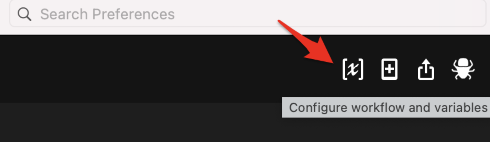

# alfred-audible 🎧
### An [Alfred](https://www.alfredapp.com/) workflow to interact with your [Audible](https://apps.ankiweb.net) library and wish list based on [audible-cli](https://github.com/mkb79/audible-cli), an unofficial Audible API by [mkb79](https://github.com/mkb79) 

<a href="https://github.com/giovannicoppola/alfred-audible/releases/latest/">
 
</a>

<!-- MarkdownTOC autolink="true" bracket="round" depth="3" autoanchor="true" -->

- [Motivation](#motivation)
- [Setting up](#setting-up)
- [Basic Usage](#usage)
- [Known Issues](#known-issues)
- [Acknowledgments](#acknowledgments)
- [Changelog](#changelog)
- [Feedback](#feedback)

<!-- /MarkdownTOC -->

# Motivation ✅
- Being able to search my library and wish list, as well as the Audible catalog, from Alfred. 
- Being able to add or remove items from the wishlist. 

# Setting up ⚙️
## Needed

- Alfred with Powerpack license
- Python3 (howto [here](https://www.freecodecamp.org/news/python-version-on-mac-update/))
- an [Audible](https://www.audible.com/) account
- `pip3` installed (how to [here](https://dev.to/stankukucka/how-to-install-pip3-on-mac-2hi4))

## Setting up a new Audible device 📲
- This procedure will add your computer as a mobile device (such devices are listed and can be managed on your [Amazon account](https://www.amazon.com/hz/mycd/digital-console/devicedetails?deviceFamily=AUDIBLE_APP)). Enter `audible:setup` in Alfred to start setting up a new device. A Terminal window will open with the questions below. Hitting Enter (default answer) will be OK except for the ones **in bold**
 	
	- Please enter a name for your primary profile [audible]: 
	- **Enter a country code for the profile**: *(one of 'us', 'ca', 'uk', 'au', 'fr', 'de', 'es', 'jp', 'it', 'in')*
	- Please enter a name for the auth file [audible.json]
	- Do you want to encrypt the auth file? [y/N]:
	- Do you want to login with external browser? [y/N]:
	- Do you want to login with a pre-amazon Audible account? [y/N]: *unless you do have a pre-amazon account*
	- **Do you want to continue? [y/N]:** *enter `y` to proceed*
	- **Please enter your amazon username:** *enter your audible/amazon account info*
	- **Please enter your amazon password:** *enter your audible/amazon account info*
	- **Repeat for confirmation:**
	- **Confirm account information** *note: default here is Abort, need to enter `y`*
	- Captcha found... Open Captcha with default image viewer [Y/n]:
	- **Answer for CAPTCHA:**
	- Approval alert detected! Amazon sends you a mail.
	- **Please press ENTER when you approve the notification.**
- Close the Terminal window

## Default settings 
- In Alfred, open the 'Configure Workflow and Variables' window in `alfred-audible` preferences
	
	
	- _Optional:_ set the emoji you want to show to mark when a record is in your library (`LIBRARY_SYMBOL`, default: 📗) or in your wishlist(`WISHLIST_SYMBOL`, default: 📕)
	- _Optional:_ set the worklow variable `CATALOG_RESULTS` to control the max number of returned results (default and max is 50)
	- _Optional:_ Change the keyword to launch library/wishlist search (currently set to `@a`), or set a hotkey
	- _Optional:_ Change the keyword to launch catalog search (currently set to `@c`), or set a hotkey
	- _Optional:_ Change the database refresh frequency in days (`UPDATE_DAYS` default: 30 days)

# Basic Usage 📖
## Searching your library and wish list 🔍
- Launch `alfred-audible` with the keyword or hotkey. Type additional characters to query library and wish list. ✅ marks read items. 
- `enter` (`↩️`) open the item on the Audible website
- `shift` (`⇧`, preview) preview the audiobook cover 
- `command-enter` (`⌘↩️`) search books by the (first) author
- `option-enter` (`⌥↩️`) search books narrated by the (first) narrator
- `ctrl-enter` (`^↩️`) remove items from the wish list
- `shift-cmd-enter` (`⇧⌘↩️`) open your library on the Audible website (*need to be logged in*)
- `ctrl-cmd-enter` (`^⌘↩️`) open your wish list on the Audible website (*need to be logged in*)

## Searching the Audible catalog 📚
- Launch `alfred-audible` with the keyword or hotkey. Type additional characters to query the Audible catalog. Items in your library or wishlist are marked with the corresponding icon. ✅ marks read items. 
- `enter` (`↩️`) open the item on the Audible website
- `command-enter` (`⌘↩️`) search books by the (first) author
- `option-enter` (`⌥↩️`) search books narrated by the (first) narrator
- `shift-enter` (`⇧↩️`) show audiobook description
- `ctrl-enter` (`^↩️`) add or remove items from the wish list
- `shift-cmd-enter` (`⇧⌘↩️`) open your library on the Audible website (*need to be logged in*)
- `ctrl-cmd-enter` (`^⌘↩️`) open your wish list on the Audible website (*need to be logged in*)

## Refreshing the database 🔄
- database will refresh as indicated by the `UPDATE_DAYS` variable. 
- launch `audible:refresh` to force database refresh

# Limitations & Known issues ⚠️
- None for now, but I have not done extensive testing, let me know if you see anything!
- tested with Python 3.8.9

# Acknowledgments 😀

- [@mkb79](https://github.com/mkb79) for developing the `audible` API library and for great help and support!
- icons from [srip](https://www.flaticon.com/authors/srip), and [freepik](https://www.flaticon.com/authors/freepik), [www.flaticon.com](www.flaticon.com)
- [Vítor Galvão](https://github.com/vitorgalvao) for [OneUpdater](https://github.com/vitorgalvao/alfred-workflows/tree/master/OneUpdater) and terrific help on the Alfred forum.
- The [Alfred forum](https://www.alfredforum.com) community.

# Changelog 🧰

- 04-23-2022: version 0.1

# Feedback 🧐

Feedback welcome! If you notice a bug, or have ideas for new features, please feel free to get in touch either here, or on the [Alfred](https://www.alfredforum.com) forum. 
